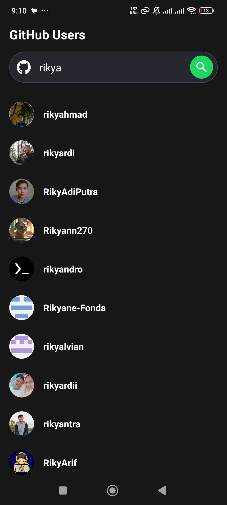
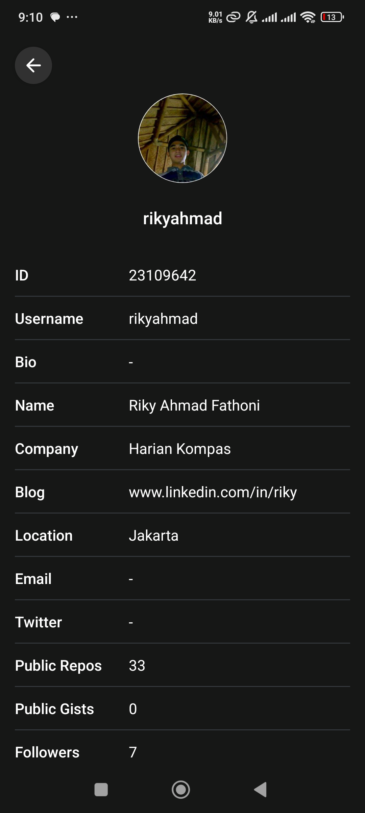

# 📱 GitHub User Search


A simple Android application to search GitHub users and view their details, built with **MVVM**, **Hilt**, **Room**, **Retrofit**, and **ViewBinding**.

---

## ✨ Features
- 🔍 Search GitHub users by username  
- 📄 View user details (username, avatar, bio)  
- 💾 Offline caching using Room database  
- 📡 Fetch data from GitHub API using Retrofit & Moshi  
- 📱 Clean MVVM architecture with Repository pattern  
- 🔔 Android 13+ notification permission handling  

---

## 🛠 Tech Stack
- **Kotlin**
- **MVVM Architecture**
- **Hilt** for dependency injection
- **Room** for local database
- **Retrofit + Moshi** for network calls & JSON parsing
- **Coroutines** for asynchronous programming
- **ViewBinding** for UI binding
- **Material Components** for UI design

---

## 📂 Project Structure
```
app/
 ├── data/              # Data layer (API, DB, Repository implementations)
 ├── domain/            # Domain layer (Models, Repository interface)
 ├── presentation/      # UI layer (Activities, ViewModels, Adapters)
 ├── external/          # Helpers, extensions
```

---

## 📸 Screenshots
| Main Screen | Detail Screen |
|-------------|---------------|
|  |  |

---

## 🚀 Getting Started

### Prerequisites
- Android Studio Ladybug or newer
- JDK 11+
- Gradle 8+
- GitHub Personal Access Token (optional if rate-limited by API)

### Clone the Repository
```bash
git clone https://github.com/your-username/github-user-search.git
cd github-user-search
```

### Open in Android Studio
1. Open Android Studio
2. Select **Open Project**
3. Choose the cloned folder

### Run the App
- Connect an Android device or start an emulator  
- Press **Run ▶️** in Android Studio  

---

## 🔧 Configuration

If you encounter API rate limits, create a **GitHub Personal Access Token** and add it to your `local.properties`:
```properties
GITHUB_TOKEN=your_personal_access_token
```

---

## 🧪 Testing

Run unit tests:
```bash
./gradlew test
```

Run UI tests:
```bash
./gradlew connectedAndroidTest
```

---

## 📡 API Reference

### Search Users
```
GET https://api.github.com/search/users?q={username}
```

### Get User Detail
```
GET https://api.github.com/users/{username}
```

---

## 📜 License
This project is licensed under the MIT License - see the [LICENSE](LICENSE) file for details.
